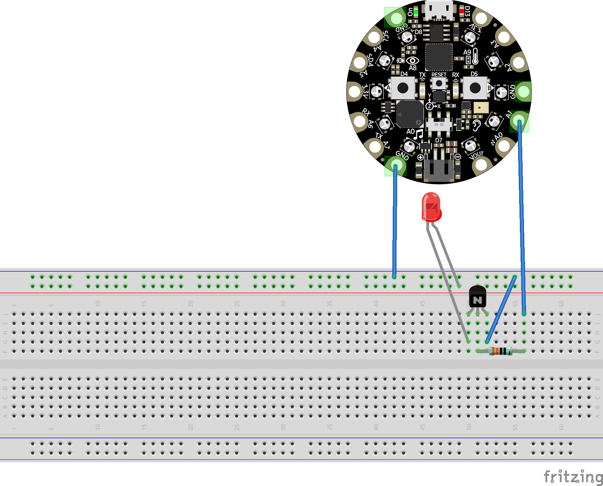
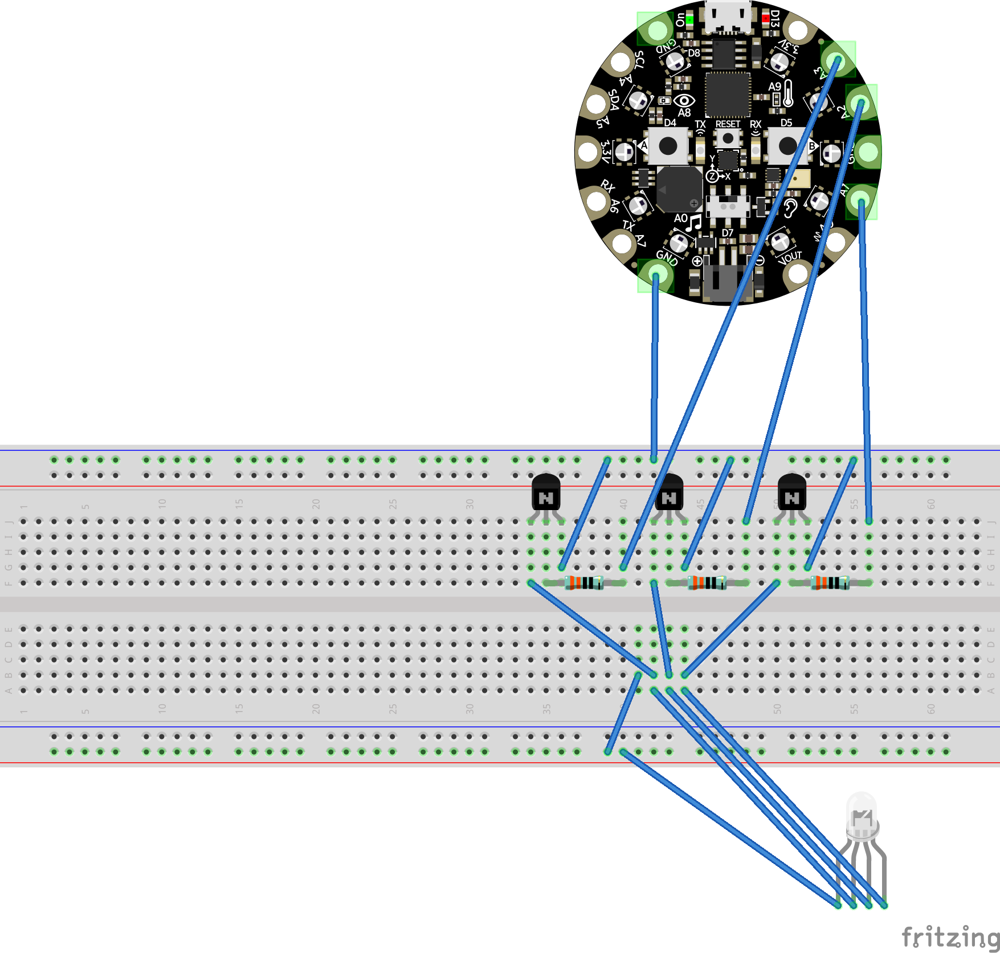

# Sesión 08

En esta sesión revisaremos algunos casos, hablaremos de algunos componentes que han quedado pendientes y seguiremos esbozando alguna solución para el futuro. 

Hablaremos de motores y servomotores. Buscaremos activar y controlar al menos tres tipos de motores. 

Desdoblaremos la acción con dos tipos de aproximaciones al prototipado: con placas de pruebas y con los textiles que hemos utilizado en otra ocasión. 

## Casos

THREE.studies

Constanza Piña

Ejemplos en Instagram 

## Recomendaciones iniciales

Para el futuro estaremos trabajando con circuitos que activarán distintos componentes como motores o tiras LED. Podemos hacer pruebas con una protoboard entonces será importante que cuenten con una placa de pruebas, sobre todo si su proyecto o intereses se relacionan con lo que estaremos hablando el día de hoy. 

Hay una serie de componentes adicionales que podemos explorar y que estaremos definiendo en los siguientes rubros de la sesión. 

## Introducción 

Cuando trabajamos con placas como la Adafruit Circuit Playground Express (CPX), es crucial entender cómo funcionan el voltaje y el amperaje, especialmente al usar componentes adicionales como motores, servos o tiras LED, que pueden requerir más energía de la que la placa puede suministrar directamente.

### Voltaje (V) 

Es la cantidad de energía potencial por unidad de carga. En el caso de la CPX, el voltaje de alimentación es de 3.3V cuando usa su regulador interno, aunque se puede alimentar con hasta 5V a través del puerto USB o de un conector de batería externa.

Es similar a la presión del agua en una tubería. Si tenemos una tubería y queremos que el agua fluya con más fuerza, necesitamos aumentar la presión. En un circuito eléctrico, el voltaje es esta "presión eléctrica" que empuja a los electrones a través del circuito.

### Amperaje (A)

Amperaje (A): Es la cantidad de corriente que fluye a través de un circuito. La CPX tiene limitaciones en la cantidad de corriente que puede suministrar a otros componentes; en general, no puede suministrar más de unos pocos cientos de miliamperios (mA) sin dañar sus componentes.

Es el caudal o flujo de agua, es decir, cuánta agua (o corriente eléctrica) está pasando por la tubería en un momento dado. Una tubería ancha permite que pase más agua, mientras que una tubería estrecha limita el flujo. De manera similar, un circuito con mayor amperaje permite que pase más corriente.

### Transistores

Un transistor es un componente electrónico que actúa como interruptor o amplificador de señales eléctricas. Está compuesto por materiales semiconductores, generalmente silicio, y tiene tres terminales: emisor, base y colector.

Vamos a usar el transitor como un interruptor, permitiendo o bloqueando el flujo de corriente. Cuando se aplica una pequeña corriente en la base, se permite el paso de corriente entre el colector y el emisor. Vamos a utilizar corrientes eléctricas para controlar el flujo de corriente. 

Tiene tres partes y siguiendo con la analogía del agua, se puede explicar de la siguiente manera: 

- Base: Imagina que la base del transistor es como un pequeño grifo que controla el flujo de agua.
- Colector: El colector es la tubería que lleva el agua a un destino específico.
- Emisor: El emisor es el lugar de donde proviene el agua.

Cuando abres el grifo (aplicas corriente en la base), permite que el agua (corriente eléctrica) fluya de la tubería (colector) hacia el lugar de destino (emisor). Así, con solo un pequeño giro del grifo, puedes controlar un gran flujo de agua, al igual que un transistor puede amplificar o conmutar señales eléctricas con un pequeño cambio en la corriente de la base.

### Conclusión

Cuando se usan componentes como motores o tiras LED, se necesita asegurar que tanto el voltaje (presión) como el amperaje (caudal) sean adecuados. Si no es así, podríamos enfrentar problemas como un flujo insuficiente (componente que no funciona bien) o sobrecalentamiento de la tubería (circuito quemado).

## Tiras LED

Hay distintos tipos de tiras LED. Para las activaciones del día de hoy vamos a hablar de tiras genéricas RGB y de un solo canal. 

La tira que estaremos activando se puede conseguir en Steren y es alimentada por 12v, esto quiere decir que si queremos alimentar la tira con la CPX es posible que no alcancemos a cubir sus necesidades.

Esto no está necesariamente asociado a la cantidad de LEDs sino a las resistencias asociadas a esos LEDs, de manera individual, teniendo en consideración el máximo posible de LEDs que tiene la tira (por ejemplo 300). 

El conocimiento de la alimentación es importante, podemos encontrar la información de los componentes que usamos en la caja o en la hoja de información. En este caso la información aparece impresa en la misma tira. 

IMPORTANTE: En todos los casos es importante que las tiras que conectemos compartan tierra con la alimentación externa. 

## Primera Actividad

En esta primera actividad realizaremos una prueba con la placa CPX y un segmento cortado de tira LED. Estaremos usando alimentación externa.  

Ya sabemos que los pines de la CPX tienen 3.3v que apenas alcanzan para alimentar un LED. Por otro lado, hay un pin que permite utilizar el voltaje que está entrando por la placa, pudiendo ser este alimentado por USB o por el puerto JST con una batería incluída. 

Pero aún así no tenemos suficiente potencia, entonces recurriremos a alimentación externa. 

### Requerimientos

- CPX 
- Protoboard (también podemos hacer las conexiones con caimanes pero en este punto empezarán a ser complicadas)
- Cables tipo Dupont de conector a conector
- Cables tipo Dupont de conector a caimán (también pueden cortar los cables tipo caimán)
- Tira de LED de dos cables
- Resistencia de 330 Ohms
- 1 [Transistor](https://www.steren.com.mx/transistor-de-peque-a-se-al-npn-to-206aa.html)
- 1 [Eliminador de 12V](https://www.steren.com.mx/eliminador-regulado-de-12-vcc-3-a-para-tiras-led.html)
- Conector tipo barril. 

### Esquema y código

El siguiente esquema muestra como podemos controlar la tira led con un transistor. 

La tira de LEDs está representada con un LED. 

Y con el siguiente [código](./tiraLEDdosCables/tiraLEDdosCables.py) podemos encender o apagar la tira con los botones de la CPX. 

## Segunda actividad

En la segunda actividad podremos controlar una tira LED de 4 cables (RGB). Usaremos prácticamente el mismo esquemático, tendremos que realizar una conexión para cada canal. 

Es importante detectar el orden de los cables para que coincidan con la placa de pruebas. Si leemos a partir del voltaje y luego con cada pin tenemos 12v G R B para una tira LED de Steren. 

### Requerimientos

Son prácticamente los mismos, la diferencia es que necesitamos tres transistores, tres resistencias y suficientes cables como para conectar todo.

- CPX 
- Protoboard (también podemos hacer las conexiones con caimanes pero en este punto empezarán a ser complicadas)
- Cables tipo Dupont de conector a conector
- Cables tipo Dupont de conector a caimán (también pueden cortar los cables tipo caimán)
- Tira de LED de dos cables
- 3 Resistencias de 330 Ohms
- 3 [Transistores](https://www.steren.com.mx/transistor-de-peque-a-se-al-npn-to-206aa.html)
- 1 [Eliminador de 12V](https://www.steren.com.mx/eliminador-regulado-de-12-vcc-3-a-para-tiras-led.html)
- Conector tipo barril. 

### Esquema y código

De manera similar a la primera actividad, la representación visual de una tira de LEDs es un LED sencillo. A continuación el esquema:

También es posible encontrar el [código](./tiraLEDcuatroCables/tiraLEDcuatroCables.py) para activar el cambio de colores en la tira de leds a partir de los botones a y b. 

### Preguntas para el futuro

¿Cómo podríamos tener pasos entre los colores que necesitamos sin que estos solamente sean una mezcla entre 0 y 255 para cada canal de color? 

## Motores

Los motores son dispositivos que convierten energía eléctrica en movimiento mecánico. 

Los motores de corriente continua (DC) son los más comunes en proyectos de electrónica básica, permitiendo un control sencillo de velocidad y dirección. 

También existen los servomotores, que también son motores de corriente continua, incorporan un sistema de control que permite posicionar el eje en ángulos específicos, lo que los convierte en una opción ideal para aplicaciones que requieren alta precisión

Por último, tenemos los motores paso a paso. Estos motores dividen su rotación en pasos discretos, lo que les permite moverse a posiciones específicas con precisión. 

Revisaremos tres casos específicos, los motores que solamente tienen dos cables (corriente continua), tres cables (servo motores) y 5 cables (motores paso a paso).

### Dos cables

Son los motores más sencillos, podemos aplicar alimentación y el motor echará a andar. En la sección de control más abajo encontraremos información sobre cómo podemos controlar el motor más allá de echarlo a andar o no. 

### Servomotores y tres cables

 Tipo de motor de corriente continua que permite controlar con precisión el ángulo de rotación del eje. Este tipo de motor se compone generalmente de un motor DC, un potenciómetro y un circuito de control interno, lo que permite especificar la posición del eje en lugar de solo la velocidad o dirección.

 El cable que controla la señal es blanco, amarillo o naranja. 

 El cable de alimentación es rojo. 

 El cable de tierra es negro o marrón. 

 A contiuación, un ejemplo para la cpx y para Circuit Python. Noten que es necesario agregar una librería a la placa. Las limitaciones del servo motor son factores importantes a considerar. 

 [Código](./servoTres/servoTres.py)

### Cinco cables

Motor paso a paso de 4 fases, esto generalmente significa que tiene cuatro bobinas organizadas en dos pares.Tienen cuatro bobinas, que pueden ser controladas de manera secuencial para generar movimiento.

El motor se activa en una secuencia específica que energiza dos bobinas a la vez. Por ejemplo, en un motor unipolar, se podría activar Bobina 1 y Bobina 2 simultáneamente, luego Bobina 2 y Bobina 3, y así sucesivamente.

El motor que vamos a usar utiliza un controlador con LEDs incorporados que indican la bobina que está siendo activada. 

## Conclusión

Relación entre potencia, inercia y motor define el resultado. 

## Si da tiempo...

Retomar la idea del circuito bordado. 

