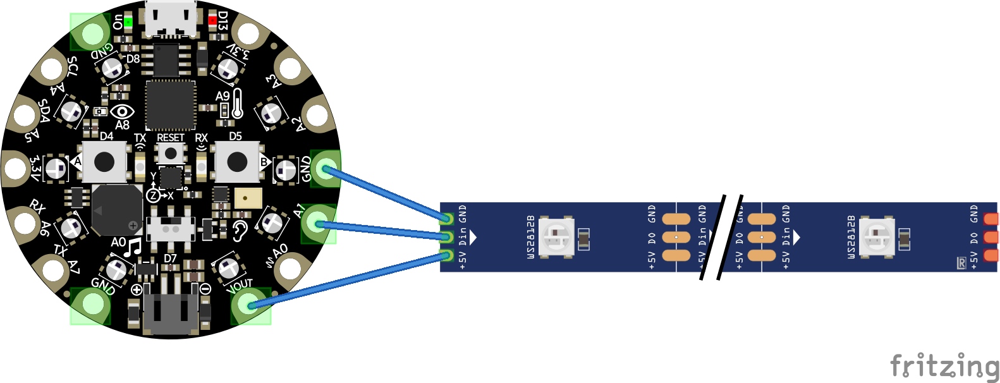
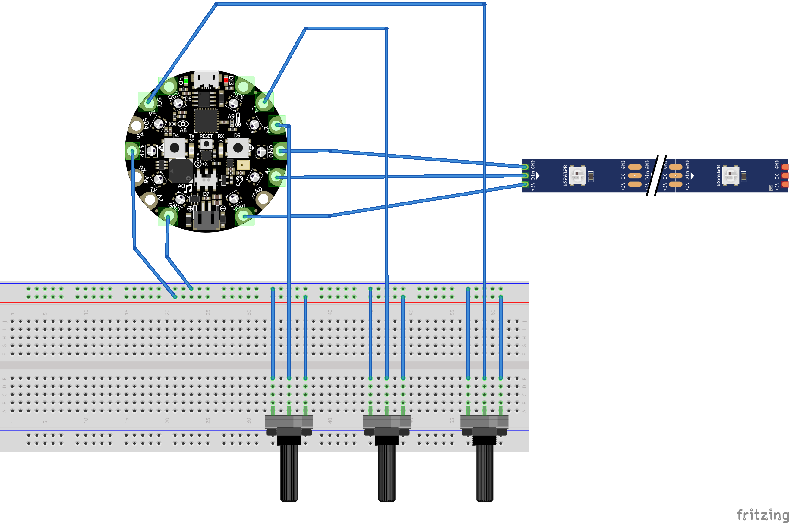
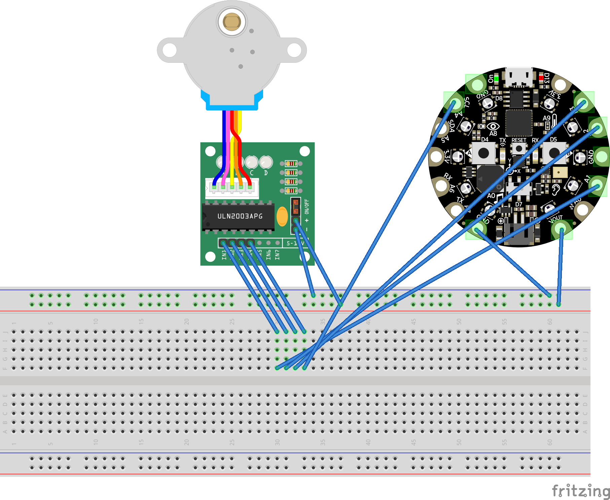

# Sesión 11

En esta sesión concluiremos la sesión de ejercicios sencillos que nos permitirán tener una aproximación a la relación entre programación e iluminación. 

Caso de uso: tira de LEDs audioreactiva para una presentación audiovisual. 

Librerías relevantes: [FastLED](https://github.com/FastLED/FastLED) y [Adafruit Neopixel](https://github.com/adafruit/Adafruit_NeoPixel)

## Ejercicio 1

Antecedente. Será necesario hablar del funcionamiento de las tiras LED de 3 cables que nos permiten modificar de manera independiente el color de cada uno de los pixeles. 

En este primer ejercicio vamos a encender una tira o segmento de tira con la placa CPX. Utilizaremos MakeCode para realizar esto y pensaremos si es necesario pasar a otro tipo de programación (Circuit Python o Arduino) para resolver cambios más interesantes. 

Tal vez sea necesario soldar algunos cables en la tira o extracto de tira para tener un poco más de estabilidad. 

## Ejercicio 2

En este segundo ejercicio será necesario hablar de potenciómetros rotatorios. Básicamente son resistencias de tres terminales que funcionan como un divisor de voltaje. 

Vamos a utilizar el pin de 3.3v para alimentar a los potenciométros y vamos a hacer una lectura con los pines A2 A3 y A4 de los valores de voltaje. Los valores que leeremos tendrán un rango de 0 a 1023.

Dentro del programa necesitaremos ajustar estos valores para coincidan con la magnitud que estamos usando (color que va de 0 a 255). 

En este segundo modificaremos los valores de la tira led con tres potenciómetros, cada uno corresponderá con un canal de color. Para realizar esto necesitaremos una protoboard y algunos cables de conexión. A continuación el esquema necesario: 

## Ejercicio 3

Controlar un motor con makecode y potenciómetros / control remoto. 

Un motor de pasos nos permitirá cambiar el sentido y la velocidad fácilmente, podemos hacer pruebas con un motor sencillo y después podemos cambiar a un motor alimentado. 

[Motor a Pasos 28BYJ-48](https://uelectronics.com/producto/motor-a-pasos-con-controlador/) Nos da una idea de cómo debería funcionar un sistema de apertura (un sentido) y cierte (sentido opuesto).

El controlador del motor ya viene incluído entonces podemos hacer pruebas directamente con una protoboard y la alimentación incorporada de la CPX

Recuerden, es un motor de pruebas entonces necesitamos pensar en soluciones que puedan resolver problemas más complejos, como mayor peso de carga y por lo tanto mayor potencia. 

Podemos revisar casos específicos, por ejemplo: [Motores para cortinas](https://uelectronics.com/producto/sonoff-zbcurtain-motor-inteligente-para-cortina/) Aqui el reto o la diferencia consistirá en leer algún tipo de sensor y que esa información modifique el estado de los motores. 

Algunas opciones para motores más potentes: [Nema](https://uelectronics.com/producto/nema-17-motor-a-pasos-17hs8401/) y [driver](https://uelectronics.com/producto/a4988-driver-para-motor-a-pasos-con-disipador/)

## TouchDesigner (ahora sí)

Podemos usar Arduino y TouchDesigner para controlar luces al vuelo, de una manera precisa y gráfica. 

[Código TD]()

[Código Arduino]()

## Actividad adicional

Controles IR para cambiar estados en los motores o transiciones entre colores en una tira LED. 